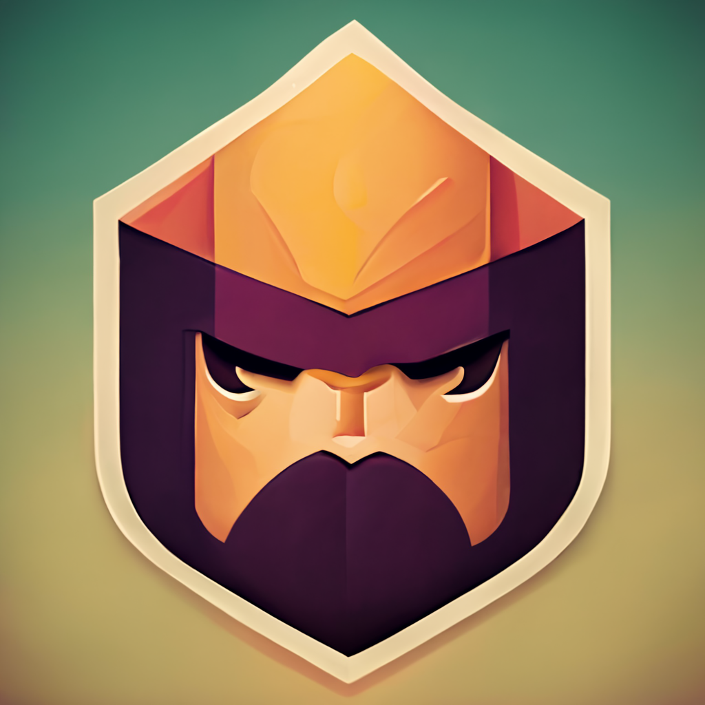

[](https://discord.gg/UDNcTrBagN)
[](https://twitter.com/vkxni)
[](https://github.com/alelievr/Mixture/blob/master/LICENSE)

# <p align="center">ClashOfClans.ex

<p align="center">A <strong>functional</strong> Clash of Clans APi Wrapper written in pure Elixir.</p>

<p align="center">
</a>
<p>

```elixir
defmodule Example do
  alias Clashofclans.Base.Players

  def playername(playertag) do
    Players.playername(playertag)
  end
end

# returns the name of the player
Example.playername("your-tag-here")
```

---

## Getting started

_Please only use the latest version of the package - we do not offer support for any lower or outdated versions._

> #### Installing

[https://hex.pm/packages/clashofclans](https://hex.pm/packages/clashofclans)

```elixir
def deps do
    [{:clashofclans, "~> 1.3.0"}]
end
```

```
$ mix deps.get
```

> #### Configuration
>
> Since we (currently) only support authentication through APi tokens, you will need to get one from the [Clash of Clans API](https://developer.clashofclans.com/#/account) website. Once you have your token, you can add it to your `config/config.exs` file like so:

`config/config.exs`

```elixir
# Without sourcing
import Config

config :clashofclans, api_key: "super-secret-api-key-here"
```

`config/config.exs`

```elixir
# With sourcing
import Config

config :clashofclans, api_key: System.get_env("API_KEY")
```

**With this method you have to run `source .env` before running/building your application.**

_Note:_ If you want to use a custom ENV environment on runtime, then use a custom library like [https://hex.pm/packages/dotenv_parser](https://hex.pm/packages/dotenv_parser).

`.env` example

```
export API_KEY="super-secret-api-key-here"
```

You can directly pass in the APi key if you use a custom/runtime environment, but
make sure the `.env` is in your root directory.

> ### Queries, functions, modules

#### 1.) Modules

- [x] Clan
- [x] Player
- [x] Leagues
- [x] Gold pass
- [x] Verification
- [ ] Locations
- [ ] Mail Authentication
- [ ] Error Handling

#### 2.) Endpoints

> Base

`Base.Players/1`

- playername(playertag)
- townhall(playertag)
- xp(playertag)
- trophies(playertag)
- highest_trophies(playertag)
- clanrole(playertag)
- donations(playertag)
- clanrole(playertag)
- warpreference(playertag)
- attackwins(playertag)
- defensewins(playertag)
- players_clanlevel(playertag)
- players_clanname(playertag)
- players_clantag(playertag)

```elixir
alias Clashofclans.Base.Players

def clanrole(playertag) do
  Players.clanrole(playertag)
end
```

`Base.Clans/1`

- clanname(clantag)
- clanlevel(clantag)
- clanpoints(clantag)
- clanlocation(clantag)
- clanlanguage(clantag)
- clantype(clantag)
- clandescription(clantag)

```elixir
alias Clashofclans.Base.Clans

def clanlocation(clantag) do
  Clans.clanlocation(clantag)
end
```

> Extended

`Extended.Players/1`

- townhallweapon(playertag)
- builderhalllevel(playertag)
- highest_versus_trophies(playertag)
- versus_trophies(playertag)
- versus_win_count(playertag)
- versuswins(playertag)
- barbariankinglevel(playertag)
- archerqueenlevel(playertag)
- grandwardenlevel(playertag)
- royalchampionlevel(playertag)
- battlemachinelevel(playertag)

- verifyplayer(playertag, token)

```elixir
alias Clashofclans.Extended.Players

def barbariankinglevel(playertag) do
  Players.barbariankinglevel(playertag)
end
```

`Extended.Clans/1`

- clanversustrophies(clantag)
- capital_state(clantag)
- capital_attacklog(clantag)
- capital_defense_reward(clantag)
- capital_endtime(clantag)
- capital_starttime(clantag)
- enemy_districts_destroyed(clantag)
- capital_totalloot(clantag)
- capital_totalattacks(clantag)
- public_warlog(clantag)
- warfrequency(clantag)
- warleague(clantag)
- warwins(clantag)
- warwinstreak(clantag)
- clanmember_list(clantag)
- clanmember_count(clantag)
- required_th_level(clantag)
- required_trophies(clantag)
- required_versus_trophies(clantag)

```elixir
alias Clashofclans.Extended.Clans

def th_level(clantag) do
  Clans.required_th_level(clantag)
end
```

`Extendend.LegendLeague/1`

- best_legend_season(playertag)
- current_legend_season(playertag)
- legend_trophies(playertag)
- previous_legend_season_rank(playertag)
- previous_legend_season_trophies(playertag)
- previous_legend_season_id(playertag)

```elixir
alias Clashofclans.Extendend.LegendLeague

def legend_trophies(playertag) do
  LegendLeague.legend_trophies(playertag)
end
```

`Leagues/0`

- legend_league
- titan_league_three
- titan_league_two
- titan_league_one
- champion_league_three
- champion_league_two
- champion_league_one
- master_league_three
- master_league_two
- master_league_one
- crystal_league_three
- crystal_league_two
- crystal_league_one
- gold_league_three
- gold_league_two
- gold_league_one
- silver_league_three
- silver_league_two
- silver_league_one
- bronze_league_three
- bronze_league_two
- bronze_league_one
- unranked

```elixir
alias Clashofclans.Leagues

def bronze_league_one do
  Leagues.bronze_league_one
end
```

`GoldPass/0`

- goldpass_starttime
- goldpass_endtime

```elixir
alias Clashofclans.GoldPass

def goldpass_starttime do
  GoldPass.goldpass_starttime
end
```

---

© vKxni 2022, [MIT Licence](/LICENSE), by [@vKxni](https://github.com/vKxni).
```
